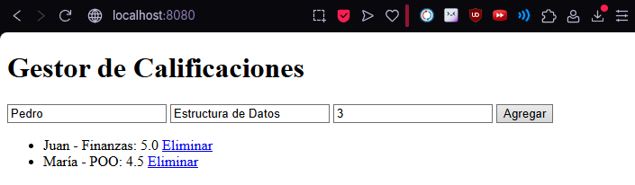

# Laboratorio 1
> Responsable: María José Jara Herrera  
> Fecha: 09/04/2025 → 09/09/2025

## Descripción de la tarea

El objetivo de este laboratorio es diseñar, construir, implementar y probar un sistema de software sencillo utilizando el estilo arquitectónico monolítico, con el fin de tener un primer acercamiento práctico a los conceptos de estructuras y propiedades del sistema.

## Tareas

### Representación gráfica de la estructura del sistema

### Descripción de 5 propiedades identificadas del sistema
1. **Todos los módulos en un solo despliegue:** Todo el sistema está contenido dentro de un solo proyecto. Todo el código corre en el mismo proceso y servidor, sin dividirse en servicios independientes.
2. **Comunicación interna directa:** Los distintos módulos de la aplicación se comunican mediante llamadas directas dentro del mismo ejecutable, sin recurrir a comunicación en red como APIs REST entre servicios.
3. **Gestión centralizada del estado:** Todos los datos y el estado interno de la lógica de aplicación residen en el mismo procedimiento y espacio de memoria (excepto la base de datos).
4. **Persistencia de Datos:** Utiliza MySQL como sistema de gestión de base de datos. Los datos, especialmente las calificaciones y usuarios, se conservan de manera persistente entre sesiones y ejecuciones.
5. **Modularidad Interna:** El sistema monolítico está organizado en capas (Templates, Controllers, Services, Repositories, Models), permitiendo separar la lógica de presentación, de negocio, acceso a datos y definición de datos. Esto facilita el mantenimiento y la comprensión del sistema.

### Ejecución del Docker
