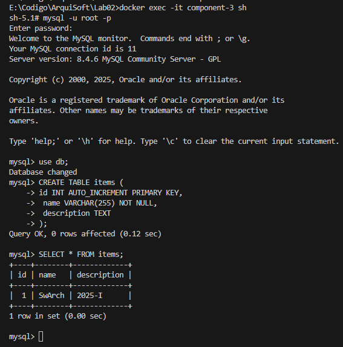
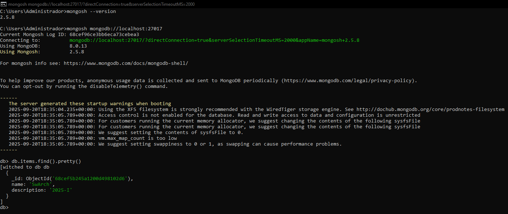

# Laboratorio 2
> Responsable: María José Jara Herrera <br>
> Fecha: 09/18/2025 → 09/22/2025

## Descripción de la tarea

El objetivo de este laboratorio es construir, implementar un conjunto de elementos arquitectónicos, para tener un primer enfoque práctico para los conceptos de componentes y conectores.

## Tareas

### Vista Componente-y-Conector

```
flowchart TD
 subgraph Persistencia_NoSQL["Persistencia No Relacional"]
        MongoDB["Componente 1 <br> MongoDB"]
  end
 subgraph API_GraphQL["API_GraphQL"]
        FastAPI["Componente 2 <br> FastAPI + GraphQL"]
  end
 subgraph Persistencia_Relacional["Persistencia Relacional"]
        MySQL["Componente 3 <br> MySQL"]
  end
 subgraph API_REST["API_REST"]
        Flask["Componente 4 <br> Flask + REST"]
  end
    FastAPI --> MongoDB
    Flask --> MySQL
    REST[("Cliente externo <br> REST")] --> Flask
    GraphQL[("Cliente externo <br> GraphQL")] --> FastAPI
```



### Descripción de Componentes y Conectores

#### Componentes
1. Componente 1: MongoDB:
    - Base de datos NoSQL, accesible por el Componente 2.
    - Se despliega como contenedor Docker usando la imagen oficial de MongoDB.
2. Componente 2: API GraphQL (FastAPI + Strawberry)
    - Ofrece una API GraphQL para gestionar y consultar datos almacenados en MongoDB.
    - Se conecta internamente con MongoDB mediante URI definida en el entorno de Docker.
    - Expone el endpoint /graphql.
3. Componente 3: MySQL
    - Base de datos relacional, usada por el Componente 4.
    - Se despliega en un contenedor usando la imagen oficial de MySQL.
4. Componente 4: API REST (Flask)
    - Proporciona endpoints REST para crear y consultar datos de la base MySQL.
    - Se conecta internamente a MySQL usando las variables de entorno definidas.

#### Conectores
- Conector entre Componente 2 y Componente 1: Comunicación directa mediante el driver de MongoDB (motor.motor_asyncio).
- Conector entre Componente 4 y Componente 3: Driver mysql-connector-python.
- Clientes externos: Acceden a la API REST de Flask (Componente 4) y a la API GraphQL de FastAPI (Componente 2) vía HTTP.

### Ejecución del Docker

#### Flow 1




#### Flow 2


